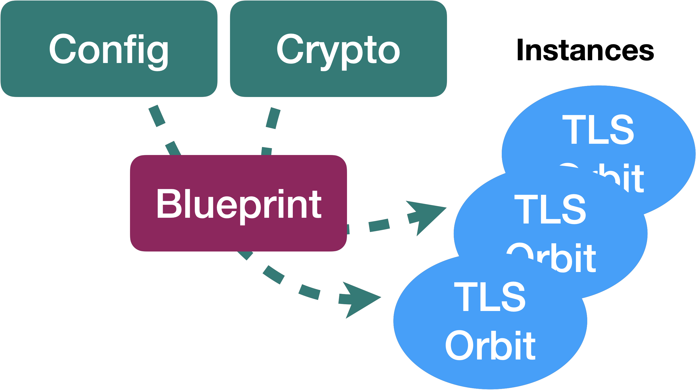

# yaws TLS Orbits

This repository consists of the [Blueprint] & [Orbit] implementations of Transport Layer Security (TLS) part of YAWS to provide the de-coupled [sans-io] networking stack.

## Options

The below options are wired up:

| Suite  | Requires std? | Requires alloc? | BYO CryptoRng | BYO Crypto         |
| :---   | :---          | :---            | :---          | :---               |
| [rustls] | opt-in        | yes             | no            | yes                |
| [yTLS]   | no            | no              | yes           | yes                |

## Validation

Testing and validation is done against OpenSSL

## Usage

Typically these Orbits are used and configured through YAWS runtimes.

To use them, see examples from the [test_ab](./test_ab) sources.

[rustls]: ./rustls-blueprint
[ytls]: ./ytls-blueprint
[Blueprint]: https://yaws-rs.github.io/book/traits/blueprint.html
[Orbit]: https://yaws-rs.github.io/book/traits/orbit.html
[sans-io]: https://yaws-rs.github.io/book/traits/overview.html
