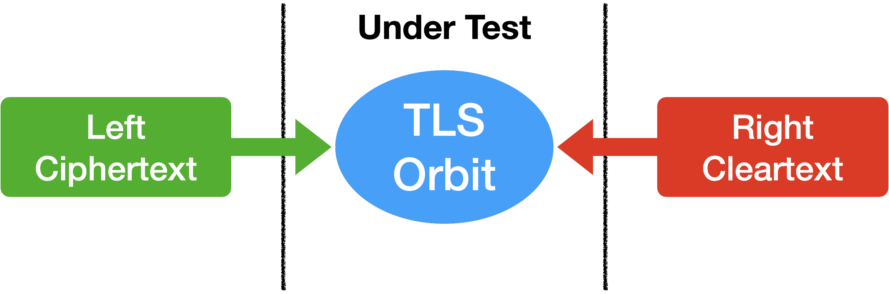
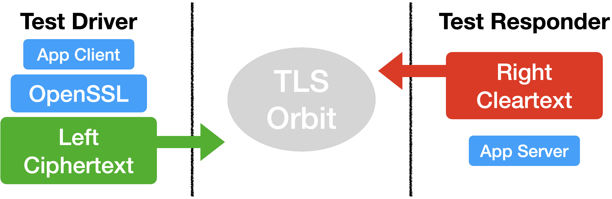

# A/B Test YAWS TLS Blueprints

Serves to A/B test switchable YAWS TLS Orbits against OpenSSL

# Under Test

The tests are data driven and injected through Left and Right trait implementations.

# Left and Right Driver

Left side is the OpenSSL "network" side and the Right side is the Application responder side.

